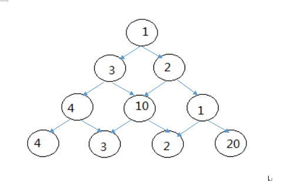

>题目

有一个由非负整数组成的三角形，第一行只有一个数，除了最下行之外每个数的左下方和右下方各有一个数，如下图：

从第一行开始，每次可以往做下或右下走一格，直到走到最下行，把沿途经过的数全部加起来，如何走才能使得这个和最大。
>分析

可以从下往上来分析
如下:  
1  
3 2  
4 10 1  
4 3 2 20  
从下开始往上更新。  

第1次更新为：  
1  
3 2  
**8 13 21**  
4 3 2 20  

第2次更新：  
1  
**16 23**  
8 13 21  
4 3 2 20  

第3次更新：  
**24**  
16 23  
8 13 21  
4 3 2 20  


三种实现方法：递归、递推、记忆化搜索  
​    
---

```java
/*
递归
4
1
3 2
4 10 1
4 3 2 20
 */
import java.util.Scanner;

public class Main {

  static int [][]a = new int [100][100];   //用来存储数字三角形的数据
  static int [][]c = new int [100][100];   //用来存路径
  static int n ;
  static int count;

  public static void main(String[] args) {
    Scanner scanner = new Scanner(System.in);
    n = scanner.nextInt();
    int i,j;
    for(i=0;i<n;i++){
      for(j=0;j<=i;j++){
        a[i][j] = scanner.nextInt();
      }
    }

    System.out.println(fun(0, 0));
    System.out.println("计算了"+count+"次");

    //输出走的路径
    System.out.print("路径如下：(0,0)");
    int t = 0;
    for(i=1;i<n;i++){
      System.out.print("->("+i+","+c[i-1][t]+")");
      t = c[i-1][t];
    }

  }

  public static int fun(int i,int j){
    if(i == n-1)
      return a[i][j];   //如果到了最下面一层，就返回当前这个数
    count++;

    int t1 = fun(i+1, j);
    int t2 = fun(i+1, j+1);
    if(t1>t2){
      c[i][j] = j;  //表示当前这个位置是从下一行哪个数据来的
      return a[i][j]+t1;
    }else {
      c[i][j] = j+1;  //表示当前这个位置是从下一行哪个数据来的
      return a[i][j]+t2;
    }

    //return a[i][j] + Math.max(fun(i+1, j), fun(i+1, j+1));
  }

}
```

---

```java
/*
 * 递推
 */

import java.util.Scanner;

public class Main {

  static int [][]a = new int [4][4];
  static int [][]d = new int [4][4];
  static int n ;
  static int count;

  public static void main(String[] args) {
    Scanner scanner = new Scanner(System.in);
    n = scanner.nextInt();
    int i,j;
    for(i=0;i<n;i++){
      for(j=0;j<=i;j++){
        a[i][j] = scanner.nextInt();
        d[i][j] = a[i][j];
      }
    }
    for(i=n-1;i>=1;i--){
      for(j=0;j<i;j++){
        count++;
        d[i-1][j]+=Math.max(d[i][j], d[i][j+1]);
      }
    }
    System.out.println(d[0][0]);
    System.out.println("计算了"+count+"次");

  }

}
```

---

```java
/*
 * 记忆化搜索
 */


import java.util.Scanner;

public class Main {
  static int [][]a = new int [100][100];
  static int [][]d = new int [100][100];
  static int n ;
  static int count;

  public static void main(String[] args) {
    Scanner scanner = new Scanner(System.in);
    n = scanner.nextInt();
    for(int i=0;i<n;i++){
      for(int j=0;j<=i;j++){
        a[i][j] = scanner.nextInt();
      }
    }
    System.out.println(fun(0, 0));
    System.out.println("计算了"+count+"次");
  }

  public static int fun(int i,int j){
    if(i == n-1)
      return a[i][j];   //如果到了最下面一层，就返回当前这个数

    if(d[i][j]!=0) return d[i][j];

    count++;   //统计 计算了多少次
    d[i+1][j] = fun(i+1, j);
    d[i+1][j+1] = fun(i+1, j+1);
    return a[i][j] + Math.max(d[i+1][j], d[i+1][j+1]);
  }

}
```
